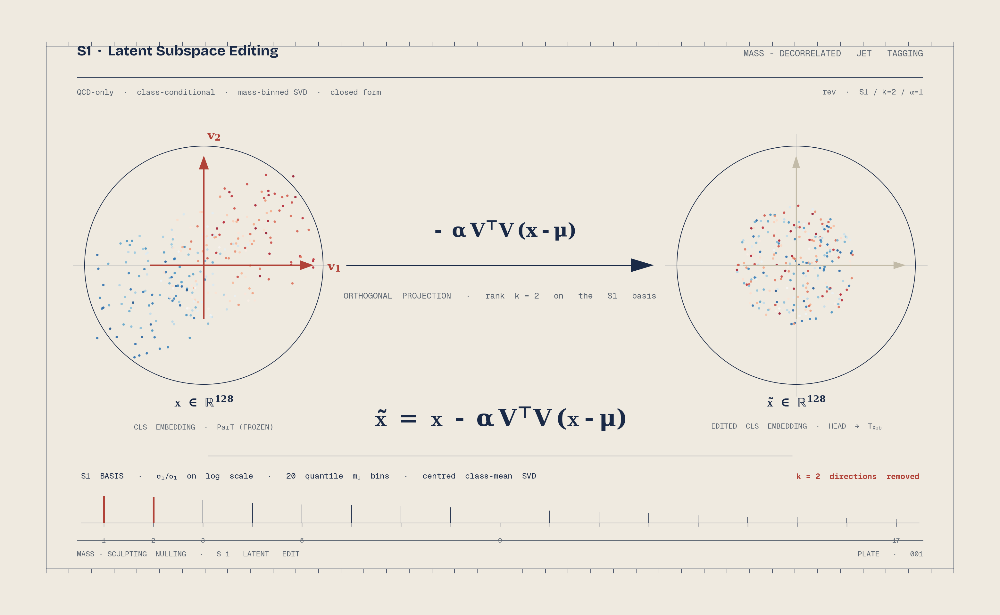
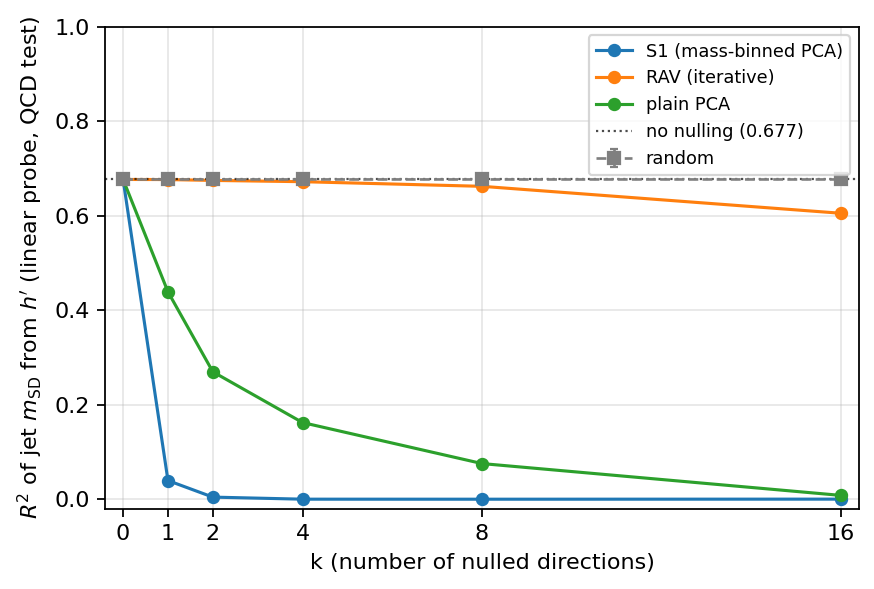
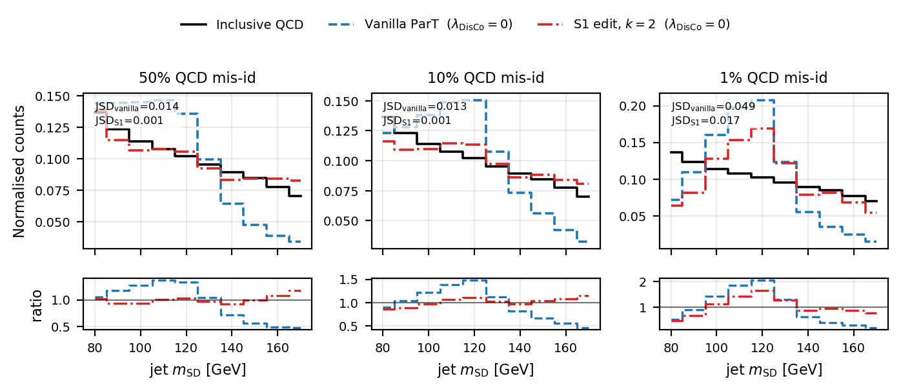

# Mass-Sculpting Nulling

<p align="center">
  
</p>

This repository contains experiments on reducing QCD jet-mass *sculpting* in the
latent representation of a frozen [Particle Transformer](https://arxiv.org/abs/2202.03772) (ParT)
jet tagger. The central object is **S1** — a mass-binned, class-conditional PCA
on the QCD subset that identifies the directions along which the QCD CLS embedding
shifts as a function of the jet soft-drop mass $m_J$, so they can be projected out
in closed form before the classifier head.

The repo also implements:

- DisCo (distance-correlation) score-level regularisation as a finetuning baseline,
- frozen-head and finetuned Pareto sweeps over latent-edit rank $k$, projection
  strength $\alpha$, and DisCo weight $\lambda_{\mathrm{DisCo}}$,
- a behaviorally grounded evaluation that compares **decodability** (linear-probe
  $R^2(m_J\mid \tilde{\mathbf{x}})$) with **decorrelability** (selected-QCD JSD at
  fixed mis-id rates).

## Two snapshots of what S1 does

**S1 erases linear scalar mass decodability with one direction.**

<p align="center">
  
</p>

A single S1 direction takes the linear-probe $R^2(m_J\mid \tilde{\mathbf{x}})$ from
$0.68$ to $0.04$ — an order of magnitude lower than what plain PCA, an
OLS-deflation regression-direction baseline (RCV/OLS), or a random
orthonormal subspace achieve at the same rank.

**The projection alone de-peaks the cut-passing QCD mass spectrum.**

<p align="center">
  
</p>

At the $1\%$ QCD mis-id working point, removing the leading two S1 directions
roughly halves both the Higgs-window peak excess and the high-mass-tail
suppression of the unedited ParT head — with **no DisCo penalty and no head
retraining**. Numerical $\mathrm{JSD}_\varepsilon$ / KS / $\chi^2$/ndf reductions
are reported in `results/qcd_softdrop_metrics.csv`.

That said, "linear-probe $R^2$ collapses" and "the selected-QCD mass shape is
repaired" are *not* the same statement; the full causal picture (and the
negative-result side — when scalar mass erasure does and does not predict
behavioral decorrelation) is in the paper.

## Repository layout

```
src/                     core projection, head training, evaluation
scripts/                 sweep entry-points and plot/replot scripts
results/                 metrics CSVs, PDFs, PNGs
runs/                    per-method summary.csv from the DisCo Pareto sweeps
latent/                  cached post-LayerNorm CLS embeddings (HDF5)
readme_assets/           README hero plate + design philosophy (not paper figures)
docs/methods_config.md   exact data splits, training settings, hardware, λ grids
```

## Quick start

The cached CLS embeddings live in `latent/`. With them in place, the cheap
replot scripts run locally without a GPU:

```bash
# Linear-probe R² vs k (Fig. 2 in the paper)
python scripts/replot_r2_vs_k.py

# Selected-QCD mass histograms + bootstrap metrics (Fig. 4 / Tab. 2)
python scripts/replot_mass_histograms.py --ratio-panel --annotate-jsd \
    --metrics-out results/qcd_softdrop_metrics.csv

# Frozen-head Pareto across direction sources (Fig. 3)
python scripts/replot_pareto_frozen_methods.py

# Finetuned DisCo + S1 Pareto (Fig. 5)
python scripts/replot_pareto_finetuned.py

# Scree spectrum of the S1 bin-mean matrix M (Fig. 1)
python scripts/replot_scree_M.py
```

The heavier sweep scripts (`run_disco_pareto_sweep.py`,
`run_S1_massshift_paretos.py`) require a GPU plus the original H5 + public
ParT checkpoint; see `docs/methods_config.md` for the exact reproduction
recipe.

## Reproducibility

Single global seed `1337`. Stratified $80/20$ train/val split of the JetClass
Hbb-vs-QCD subset in $m_J \in [75, 175]\,\mathrm{GeV}$. AdamW, lr $10^{-2}$,
batch $4096$, up to $40$ epochs with `ReduceLROnPlateau` + early stopping on
val loss. Histograms use $20$ uniform $5\,\mathrm{GeV}$ bins. JSD reported in
nats (natural-log convention, upper-bounded by $\ln 2$). Multi-seed Pareto
runs are listed as future work in the paper.

## License

Code: MIT. Cached embeddings derived from the public JetClass dataset;
respect its licence when redistributing.
